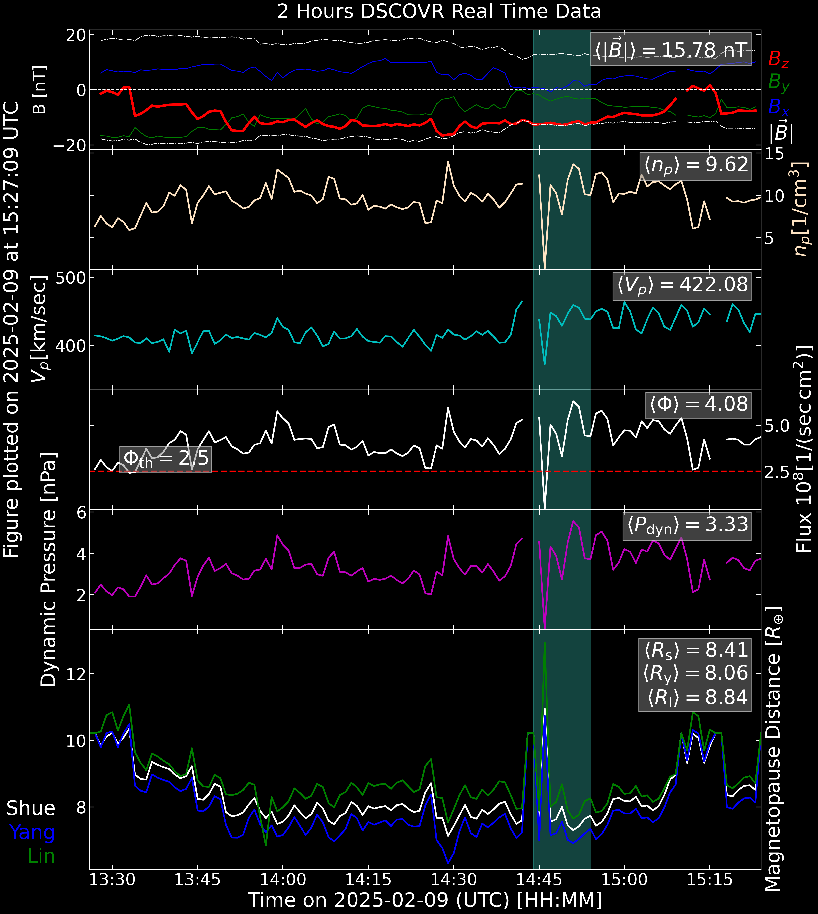
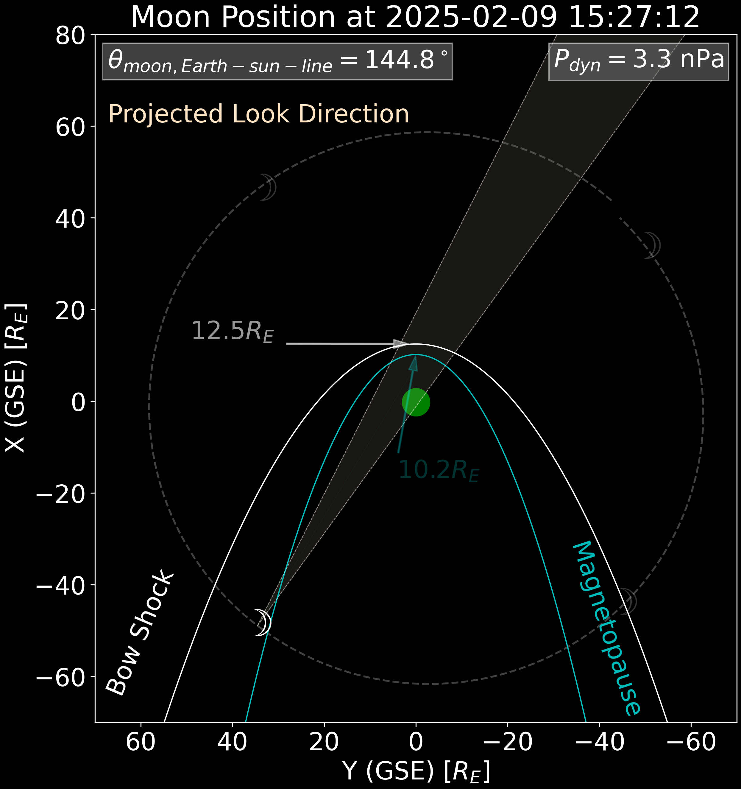

The repository to plot the real time solar wind parameters and the location of moon and the
terrestrial magnetopause and bow shock.

## Data Source
    - Magnetic field data: [SWPC NOAA](https://services.swpc.noaa.gov/products/solar-wind/mag-2-hour.json)
    - Plasma data: [SWPC NOAA](https://services.swpc.noaa.gov/products/solar-wind/plasma-2-hour.json)

The Plot gets updated every minute.

## Sample plots

Sample plot of solar wind data

Sample plot of Lunar location
